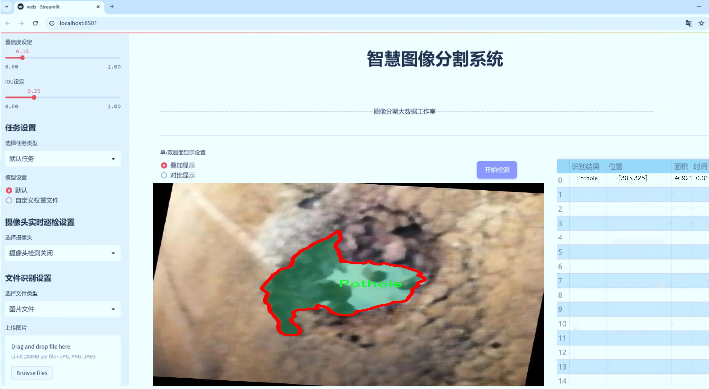

# 道路障碍物分割系统： yolov8-seg-repvit

### 1.研究背景与意义

[参考博客](https://gitee.com/YOLOv8_YOLOv11_Segmentation_Studio/projects)

[博客来源](https://kdocs.cn/l/cszuIiCKVNis)

研究背景与意义

随着城市化进程的加快，城市道路的安全性和通行效率日益受到关注。道路障碍物，如井盖、坑洞、减速带等，不仅影响了交通流畅性，还可能对行人和车辆造成安全隐患。因此，及时、准确地识别和分割这些障碍物，对于城市交通管理、道路维护及智能驾驶系统的实现具有重要意义。近年来，深度学习技术的迅猛发展为图像分割任务提供了新的解决方案，其中YOLO（You Only Look Once）系列模型因其高效的实时检测能力而备受青睐。特别是YOLOv8的推出，进一步提升了目标检测和分割的精度与速度，使其在道路障碍物检测中展现出广阔的应用前景。

本研究旨在基于改进的YOLOv8模型，构建一个高效的道路障碍物分割系统。该系统将针对特定的障碍物类别进行优化，包括井盖、开放井盖、坑洞、减速带和未标记的减速带等五类。我们使用的数据集包含3500张图像，涵盖了上述五类障碍物的多样性和复杂性。这一数据集的构建不仅考虑了不同环境下的障碍物特征，还兼顾了光照、天气等因素对图像质量的影响，为模型的训练和验证提供了丰富的样本。

在实际应用中，传统的道路障碍物检测方法往往依赖于人工巡查和图像处理技术，效率低下且容易受到人为因素的影响。而基于深度学习的自动化检测系统，能够通过实时图像分析，快速识别和定位障碍物，极大地提高了工作效率。此外，随着智能交通系统的发展，如何将障碍物检测与自动驾驶技术相结合，成为了研究的热点。通过对道路障碍物的精准分割，智能驾驶系统能够更好地理解周围环境，从而做出更为安全的行驶决策。

然而，现有的YOLOv8模型在处理道路障碍物分割任务时，仍存在一些挑战。例如，模型在复杂背景下的障碍物识别能力、不同障碍物之间的相似性导致的混淆等问题。因此，本研究将对YOLOv8进行改进，采用数据增强、特征融合等技术，提升模型在道路障碍物分割任务中的表现。通过引入更为丰富的训练样本和优化算法，我们期望能够提高模型的鲁棒性和准确性，使其在各种实际场景中均能稳定运行。

综上所述，基于改进YOLOv8的道路障碍物分割系统的研究，不仅具有重要的理论意义，也为实际应用提供了切实可行的解决方案。通过实现高效、准确的障碍物检测与分割，我们将为城市交通管理、道路安全维护以及智能驾驶技术的发展做出积极贡献。

### 2.图片演示





注意：本项目提供完整的训练源码数据集和训练教程,由于此博客编辑较早,暂不提供权重文件（best.pt）,需要按照6.训练教程进行训练后实现上图效果。

### 3.视频演示

[3.1 视频演示](https://www.bilibili.com/video/BV1RomRYuEoz/)

### 4.数据集信息

##### 4.1 数据集类别数＆类别名

nc: 5
names: ['Manhole', 'Open-Manholes', 'Pothole', 'Speed Bump', 'Unmarked Bump']


##### 4.2 数据集信息简介

数据集信息展示

在现代智能交通系统的研究与应用中，障碍物检测与分割技术显得尤为重要。为了提升YOLOv8-seg在道路障碍物分割任务中的性能，我们构建了一个名为“testErr”的数据集，专门用于训练和评估模型的准确性与鲁棒性。该数据集涵盖了五种主要的道路障碍物类别，分别是“Manhole”（井盖）、“Open-Manholes”（敞开的井盖）、“Pothole”（坑洼）、“Speed Bump”（减速带）和“Unmarked Bump”（未标记的隆起）。这些类别的选择不仅考虑了城市道路环境中常见的障碍物类型，还反映了在实际应用中可能遇到的各种情况。

“testErr”数据集的构建过程经过了精心设计，旨在确保数据的多样性和代表性。我们从不同城市和地区收集了大量的图像数据，涵盖了不同的天气条件、光照变化以及不同的道路状况。这种多样性使得模型在训练过程中能够学习到更为丰富的特征，从而在实际应用中具备更强的适应能力。例如，井盖和敞开的井盖在城市道路中经常出现，而坑洼和减速带则是影响车辆行驶安全的重要因素。未标记的隆起则代表了那些可能被忽视但同样会对驾驶造成影响的障碍物。因此，这五种类别的设置不仅具有现实意义，也为模型的训练提供了丰富的样本。

在数据集的标注过程中，我们采用了高精度的分割标注技术，确保每一张图像中的障碍物都得到了准确的标识。标注工作由经验丰富的人工标注团队完成，他们对每一类障碍物的特征有着深入的理解。这种细致的标注工作为YOLOv8-seg模型的训练提供了坚实的基础，使得模型能够在分割任务中实现更高的准确率和召回率。

此外，为了进一步提升模型的泛化能力，我们还对数据集进行了数据增强处理。这包括随机裁剪、旋转、缩放以及颜色变换等多种技术，以增加数据的多样性并减少模型对特定样本的过拟合。通过这些处理，数据集“testErr”不仅丰富了样本的多样性，也提高了模型在不同场景下的表现能力。

在评估阶段，我们将“testErr”数据集分为训练集、验证集和测试集，以确保模型在不同阶段的性能评估具有科学性和可靠性。通过对模型在这些数据集上的表现进行全面分析，我们能够更好地理解模型的优缺点，从而为后续的优化提供指导。

总之，“testErr”数据集的构建与应用，为改进YOLOv8-seg的道路障碍物分割系统提供了强有力的支持。通过对多样化障碍物的深入研究与准确标注，我们期望该数据集能够推动智能交通领域的进一步发展，提升道路安全与行车体验。


### 5.项目依赖环境部署教程（零基础手把手教学）

[5.1 环境部署教程链接（零基础手把手教学）](https://www.bilibili.com/video/BV1jG4Ve4E9t/?vd_source=bc9aec86d164b67a7004b996143742dc)


[5.2 安装Python虚拟环境创建和依赖库安装视频教程链接（零基础手把手教学）](https://www.bilibili.com/video/BV1nA4VeYEze/?vd_source=bc9aec86d164b67a7004b996143742dc)

### 6.手把手YOLOV8-seg训练视频教程（零基础手把手教学）

[6.1 手把手YOLOV8-seg训练视频教程（零基础小白有手就能学会）](https://www.bilibili.com/video/BV1cA4VeYETe/?vd_source=bc9aec86d164b67a7004b996143742dc)


按照上面的训练视频教程链接加载项目提供的数据集，运行train.py即可开始训练



     Epoch   gpu_mem       box       obj       cls    labels  img_size
     1/200     0G   0.01576   0.01955  0.007536        22      1280: 100%|██████████| 849/849 [14:42<00:00,  1.04s/it]
               Class     Images     Labels          P          R     mAP@.5 mAP@.5:.95: 100%|██████████| 213/213 [01:14<00:00,  2.87it/s]
                 all       3395      17314      0.994      0.957      0.0957      0.0843

     Epoch   gpu_mem       box       obj       cls    labels  img_size
     2/200     0G   0.01578   0.01923  0.007006        22      1280: 100%|██████████| 849/849 [14:44<00:00,  1.04s/it]
               Class     Images     Labels          P          R     mAP@.5 mAP@.5:.95: 100%|██████████| 213/213 [01:12<00:00,  2.95it/s]
                 all       3395      17314      0.996      0.956      0.0957      0.0845

     Epoch   gpu_mem       box       obj       cls    labels  img_size
     3/200     0G   0.01561    0.0191  0.006895        27      1280: 100%|██████████| 849/849 [10:56<00:00,  1.29it/s]
               Class     Images     Labels          P          R     mAP@.5 mAP@.5:.95: 100%|███████   | 187/213 [00:52<00:00,  4.04it/s]
                 all       3395      17314      0.996      0.957      0.0957      0.0845


### 7.50+种全套YOLOV8-seg创新点加载调参实验视频教程（一键加载写好的改进模型的配置文件）

[7.1 50+种全套YOLOV8-seg创新点加载调参实验视频教程（一键加载写好的改进模型的配置文件）](https://www.bilibili.com/video/BV1Hw4VePEXv/?vd_source=bc9aec86d164b67a7004b996143742dc)

### YOLOV8-seg算法简介

原始YOLOv8-seg算法原理

YOLOv8-seg算法是YOLO系列算法的最新发展，继承了YOLOv3和YOLOv5的核心思想，并在此基础上进行了多方面的创新与改进。该算法不仅关注目标检测的精度与速度，还特别增强了对图像分割任务的支持，使其在多种应用场景中展现出卓越的性能。YOLOv8-seg的设计理念是将目标检测与实例分割相结合，旨在实现高效且准确的物体识别与分割。

在数据预处理方面，YOLOv8-seg延续了YOLOv5的策略，采用了多种数据增强技术以提高模型的鲁棒性和泛化能力。这些增强手段包括马赛克增强、混合增强、空间扰动和颜色扰动等。这些技术的结合不仅丰富了训练数据的多样性，还有效地减少了模型对特定数据分布的依赖，从而提升了在不同场景下的表现。

YOLOv8-seg的骨干网络结构是其核心之一，主要采用了C2f模块替代了YOLOv5中的C3模块。C2f模块通过引入更多的分支，增强了特征提取的能力，使得在梯度回传时能够更好地传递信息。这种结构的设计旨在提高网络对细节特征的捕捉能力，尤其是在复杂背景下的物体分割任务中，能够有效提升分割的精度。

在特征融合方面，YOLOv8-seg依然采用了FPN（特征金字塔网络）与PAN（路径聚合网络）的结合，形成了一个强大的特征金字塔结构。这一结构使得多尺度信息能够得到充分融合，从而提升了模型在不同尺度物体检测与分割中的表现。通过优化的C2f模块，YOLOv8-seg在特征融合层中进一步增强了对不同尺度特征的提取能力，使得模型在处理小物体时的表现更加出色。

YOLOv8-seg的检测头结构采用了解耦头的设计理念，这一设计使得分类与定位任务能够在不同的分支中独立进行，从而提高了模型的灵活性与准确性。通过并行的分支结构，YOLOv8-seg能够分别提取类别特征和位置特征，并通过1×1卷积层进行最终的分类与定位。这种解耦设计不仅提升了模型的性能，还简化了训练过程，使得模型能够更快地收敛。

在标签分配策略上，YOLOv8-seg采用了TOOD（Target-Oriented Object Detection）策略，取代了传统的候选框聚类方法。这一动态标签分配策略能够更有效地解决正负样本匹配的问题，尤其是在数据集不够充分的情况下，能够更好地反映数据本身的分布特征。YOLOv8-seg的损失函数设计也相应进行了优化，分类损失采用了变焦损失（Varifocal Loss），而回归损失则结合了CIoU Loss与DFL Loss。这种设计使得模型在训练过程中能够更加关注高质量的正样本，从而有效提升了目标检测与分割的精度。

此外，YOLOv8-seg在轻量化方面也进行了深入的探索。通过优化网络结构，减少不必要的计算，YOLOv8-seg能够在保持高性能的同时，显著降低模型的复杂度。这一特性使得YOLOv8-seg在资源受限的环境中依然能够高效运行，适用于实时目标检测与分割的应用场景。

总的来说，YOLOv8-seg算法通过对数据预处理、骨干网络、特征融合、检测头和标签分配策略等多个方面的创新与优化，形成了一个高效、准确且轻量化的目标检测与分割解决方案。其在实际应用中的表现，不仅体现了YOLO系列算法的持续进化，也为计算机视觉领域的研究与应用提供了新的思路与方向。随着YOLOv8-seg的不断发展与完善，未来在更多复杂场景下的应用潜力将更加广阔，推动目标检测与分割技术的进一步发展。


### 9.系统功能展示（检测对象为举例，实际内容以本项目数据集为准）

图9.1.系统支持检测结果表格显示

  图9.2.系统支持置信度和IOU阈值手动调节

  图9.3.系统支持自定义加载权重文件best.pt(需要你通过步骤5中训练获得)

  图9.4.系统支持摄像头实时识别

  图9.5.系统支持图片识别

  图9.6.系统支持视频识别

  图9.7.系统支持识别结果文件自动保存

  图9.8.系统支持Excel导出检测结果数据


### 10.50+种全套YOLOV8-seg创新点原理讲解（非科班也可以轻松写刊发刊，V11版本正在科研待更新）

#### 10.1 由于篇幅限制，每个创新点的具体原理讲解就不一一展开，具体见下列网址中的创新点对应子项目的技术原理博客网址【Blog】：


[10.1 50+种全套YOLOV8-seg创新点原理讲解链接](https://gitee.com/qunmasj/good)

#### 10.2 部分改进模块原理讲解(完整的改进原理见上图和技术博客链接)【如果此小节的图加载失败可以通过CSDN或者Github搜索该博客的标题访问原始博客，原始博客图片显示正常】
### YOLOv8模型原理

YOLOv8是YOLO系列最新的模型,具有非常优秀的检测精度和速度。根据网络的深度与特征图的宽度大小, YOLOv8算法分为:YOLOv8-n、YOLOv8一s 、YOLOv8-m 、 YOLOv8-l、和 YOLOv8-x 5个版本。按照网络结构图,YOLOv8可分为: Inpul 、 Backbone , Neck和Head 4部分。


Backbone采用了CSPDarknet 架构，由CBS (标准卷积层)、C2f模块和 SPPF(金字塔池化）组成。通过5次标准卷积层和C2f模块逐步提取图像特征，并在网络末尾添加SPPF模块，将任意大小的输入图像转换成固定大小的特征向量。分别取P3、P4、P5层的特征提取结果，向Head输出80×80、40 × 40、20×20三个尺度的特征层。
C2f模块借鉴了残差网络(ResNet)以及ELAN的思想，其结构分为两个分支，主干部分利用Bottleneckm2%模块逐步加深网络，分支部分保留输入层通道并与主干部分特征进行融合，如图所示。通过标准卷积层提取新的特征层，相比于YOLOv5使用的C3模块，C2f模块可以在卷积层和全连接层之间建立一个平滑的转换，从而实现了参数的共享，提高了模型的效率和泛化能力。
Head采用了PAN-FPN 结构,将 Backbone输入的3个特征层进行多尺度融合，进行自顶向下(FAN)和自底向上 (PAN)的特征传递，对金字塔进行增强，使不同尺寸的特征图都包含强目标语义信息和强目标特征信息，保证了对不同尺寸样本的准确预测。
Detect借鉴了Decoupled-Head 思想，用一个解耦检测头将输入的不同尺寸特征层分成2个分支进行检测。第1个分支在进行3次卷积后使进行回归任务，输出预测框。第2个分支在进行3次卷积后进行分类任务，输出类别的概率。采用Varifocal_Loss2”作为损失函数，其式为:


### Context_Grided_Network(CGNet)简介
参考该博客提出的一种轻量化语义分割模型Context Grided Network(CGNet)，以满足设备的运行需要。

CGNet主要由CG块构建而成，CG块可以学习局部特征和周围环境上下文的联合特征，最后通过引入全局上下文特征进一步改善联合特征的学习。


 
下图给出了在Cityscapes数据集上对现有的一些语义分割模型的测试效果，横轴表示参数量，纵轴表示准确率(mIoU)。可以看出，在参数量较少的情况下，CGNet可以达到一个比较好的准确率。虽与高精度模型相去甚远，但在一些对精度要求不高、对实时性要求比较苛刻的情况下，很有价值。


高精度模型，如DeepLab、DFN、DenseASPP等，动不动就是几十M的参数，很难应用在移动设备上。而上图中红色的模型，相对内存占用较小，但它们的分割精度却不是很高。作者认为主要原因是，这些小网络大多遵循着分类网络的设计思路，并没有考虑语义分割任务更深层次的特点。

空间依赖性和上下文信息对提高分割精度有很大的作用。作者从该角度出发，提出了CG block，并进一步搭建了轻量级语义分割网络CGNet。CG块具有以下特点： 

学习局部特征和上下文特征的联合特征；
通过全局上下文特征改进上述联合特征；
可以贯穿应用在整个网络中，从low level（空间级别）到high level（语义级别）。不像PSPNet、DFN、DenseASPP等，只在编码阶段以后捕捉上下文特征。；
只有3个下采样，相比一般5个下采样的网络，能够更好地保留边缘信息。
CGNet遵循“深而薄”的原则设计，整个网络又51层构成。其中，为了降低计算，大量使用了channel-wise conv.

小型语义分割模型：

需要平衡准确率和系统开销
进化路线：ENet -> ICNet -> ESPNet
这些模型基本都基于分类网络设计，在分割准确率上效果并不是很好
上下文信息模型：

大多数现有模型只考虑解码阶段的上下文信息并且没有利用周围的上下文信息
注意力机制：

CG block使用全局上下文信息计算权重向量，并使用其细化局部特征和周围上下文特征的联合特征

#### Context Guided Block
CG block由4部分组成：


此外，CG block还采用了残差学习。文中提出了局部残差学习（LRL）和全局残差学习（GRL）两种方式。 LRL添加了从输入到联合特征提取器的连接，GRL添加了从输入到全局特征提取器的连接。从直观上来说，GRL比LRL更能促进网络中的信息传递（更像ResNet~~），后面实验部分也进行了测试，的确GRL更能提升分割精度。


CGNet的通用网络结构如下图所示，分为3个stage，第一个stage使用3个卷积层抽取特征，第二和第三个stage堆叠一定数量的CG block，具体个数可以根据情况调整。最后，通过1x1 conv得到分割结果。


下图是用于Cityscapes数据集的CGNet网络细节说明：输入尺寸为3*680*680；stage1连续使用了3个Conv-BN-PReLU组合，首个组合使用了stride=2的卷积，所以得到了1/2分辨率的feature map；stage2和stage3分别使用了多个CG block，且其中使用了不同大小的膨胀卷积核，最终分别得到了1/4和1/8的feature map。

需注意：

stage2&3的输入特征分别由其上一个stage的首个和最后一个block组合给出（参考上图的绿色箭头）；

输入注入机制，图中未体现，实际使用中，作者还将输入图像下采样1/4或1/8，分别给到stage2和stage3的输入中 ，以进一步加强特征传递。

channel-wise conv。为了缩减参数数量，在局部特征提取器和周围上下文特征提取器中使用了channel-wise卷积，可以消除跨通道的计算成本，同时节省内存占用。但是，没有像MobileNet等模型一样，在depth-wise卷积后面接point-wise卷积（1*1 conv），作者解释是，因为CG block需要保持局部特征和周围上下文特征的独立性，而1*1 conv会破坏这种独立性，所以效果欠佳，实验部分也进行了验证。

个人感觉此处应该指的是depth-wise卷积？

官方Git中对该部分的实现如下：


### 11.项目核心源码讲解（再也不用担心看不懂代码逻辑）

#### 11.1 ultralytics\data\augment.py

以下是经过精简和注释的核心代码部分，主要保留了与图像增强和变换相关的类及其核心方法：

```python
import random
import numpy as np
import cv2

class BaseTransform:
    """
    基础图像变换类，提供图像处理的基本框架。
    """

    def __init__(self) -> None:
        """初始化基础变换对象。"""
        pass

    def apply_image(self, labels):
        """应用图像变换到标签。"""
        pass

    def apply_instances(self, labels):
        """应用变换到标签中的对象实例。"""
        pass

    def apply_semantic(self, labels):
        """应用语义分割变换到图像。"""
        pass

    def __call__(self, labels):
        """应用所有标签变换到图像、实例和语义掩码。"""
        self.apply_image(labels)
        self.apply_instances(labels)
        self.apply_semantic(labels)


class Compose:
    """
    组合多个图像变换的类。
    """

    def __init__(self, transforms):
        """初始化组合对象，接受变换列表。"""
        self.transforms = transforms

    def __call__(self, data):
        """依次应用变换到输入数据。"""
        for t in self.transforms:
            data = t(data)
        return data


class RandomFlip:
    """
    随机水平或垂直翻转图像的类。
    """

    def __init__(self, p=0.5, direction='horizontal') -> None:
        """
        初始化随机翻转类。

        参数:
            p (float): 翻转的概率，范围在0到1之间。
            direction (str): 翻转方向，'horizontal'或'vertical'。
        """
        assert direction in ['horizontal', 'vertical'], f'支持方向为`horizontal`或`vertical`，但得到了{direction}'
        assert 0 <= p <= 1.0
        self.p = p
        self.direction = direction

    def __call__(self, labels):
        """
        应用随机翻转到图像并更新实例。

        参数:
            labels (dict): 包含图像和实例的字典。
        """
        img = labels['img']
        if self.direction == 'vertical' and random.random() < self.p:
            img = np.flipud(img)  # 垂直翻转
        if self.direction == 'horizontal' and random.random() < self.p:
            img = np.fliplr(img)  # 水平翻转
        labels['img'] = img
        return labels


class RandomPerspective:
    """
    随机透视变换类，执行旋转、平移、缩放和剪切等变换。
    """

    def __init__(self, degrees=0.0, translate=0.1, scale=0.5, shear=0.0, perspective=0.0):
        """初始化随机透视变换对象。"""
        self.degrees = degrees
        self.translate = translate
        self.scale = scale
        self.shear = shear
        self.perspective = perspective

    def __call__(self, labels):
        """应用透视变换到图像和标签。"""
        img = labels['img']
        # 透视变换逻辑...
        # 返回变换后的标签
        labels['img'] = img  # 更新标签中的图像
        return labels


class LetterBox:
    """
    用于图像检测和实例分割的图像调整和填充类。
    """

    def __init__(self, new_shape=(640, 640)):
        """初始化LetterBox对象。"""
        self.new_shape = new_shape

    def __call__(self, labels):
        """调整图像大小并添加边框。"""
        img = labels['img']
        # 计算调整比例和填充...
        # 返回更新后的标签
        labels['img'] = img  # 更新标签中的图像
        return labels


def v8_transforms(dataset, imgsz, hyp):
    """将图像转换为适合YOLOv8训练的大小。"""
    pre_transform = Compose([
        RandomFlip(direction='horizontal', p=hyp.flipud),
        RandomPerspective(degrees=hyp.degrees, translate=hyp.translate, scale=hyp.scale)
    ])
    return Compose([
        pre_transform,
        LetterBox(new_shape=(imgsz, imgsz))
    ])
```

### 代码说明
1. **BaseTransform**: 这是一个基础类，定义了图像变换的基本接口。
2. **Compose**: 该类用于组合多个变换，可以依次应用多个图像处理操作。
3. **RandomFlip**: 随机翻转图像的类，支持水平和垂直翻转。
4. **RandomPerspective**: 实现随机透视变换的类，可以进行旋转、平移、缩放等操作。
5. **LetterBox**: 用于调整图像大小并添加边框的类，常用于目标检测任务。
6. **v8_transforms**: 定义了YOLOv8模型的图像预处理和增强步骤。

这些类和方法构成了图像处理的核心部分，适用于目标检测和图像增强任务。

这个文件是Ultralytics YOLO项目中的数据增强模块，主要用于图像处理和数据增强，以提高模型的鲁棒性和准确性。文件中定义了多个类，每个类负责不同的图像变换和增强操作。

首先，`BaseTransform`类是一个基类，定义了一些基本的图像变换方法，包括应用于图像、实例和语义分割的变换。它的主要作用是提供一个统一的接口，方便后续的具体变换类进行扩展。

接下来，`Compose`类用于将多个变换组合在一起。它接受一个变换列表，并在调用时依次应用这些变换。这个类的设计使得可以灵活地添加或修改变换。

`BaseMixTransform`类是一个基类，专门用于实现混合增强（如MixUp和Mosaic）。它提供了一个基本的框架，子类可以在此基础上实现具体的混合增强方法。`Mosaic`类是其子类之一，负责将多个图像合成一个马赛克图像。该类支持4个或9个图像的组合，并提供了获取随机索引和应用混合变换的方法。

`MixUp`类也是`BaseMixTransform`的子类，主要用于实现MixUp增强。它通过对两张图像进行加权平均来生成新的图像，并更新相应的标签。

`RandomPerspective`类实现了随机透视变换和仿射变换，可以对图像及其对应的边界框、分割和关键点进行变换。它支持旋转、平移、缩放和剪切等操作，并可以根据指定的概率条件应用这些变换。

`RandomHSV`类负责对图像的HSV通道进行随机调整，包括色调、饱和度和亮度的变化。这种调整可以增加图像的多样性，帮助模型更好地适应不同的光照条件。

`RandomFlip`类用于随机翻转图像，支持水平和垂直翻转，并根据翻转的方向更新相应的实例（如边界框和关键点）。

`LetterBox`类用于调整图像大小并进行填充，以适应目标检测和实例分割的需求。它通过计算比例和填充尺寸来确保图像在保持纵横比的同时适应新的形状。

`CopyPaste`类实现了图像的复制粘贴增强，允许在图像中随机插入其他实例，以增加数据的多样性。

`Albumentations`类是一个可选的增强模块，使用Albumentations库提供的多种图像处理功能，如模糊、对比度调整等。

`Format`类用于格式化图像注释，以便在PyTorch的DataLoader中使用。它将图像、类标签和边界框标准化为统一的格式，方便后续的训练和评估。

最后，`v8_transforms`和`classify_transforms`函数提供了具体的变换组合，用于YOLOv8模型的训练和分类任务。它们将不同的变换组合在一起，形成一个完整的图像处理管道。

总的来说，这个文件通过定义多个类和函数，实现了丰富的图像增强功能，为YOLO模型的训练提供了强大的数据处理支持。

#### 11.2 ultralytics\nn\extra_modules\ops_dcnv3\functions\dcnv3_func.py

以下是经过简化和注释的核心代码部分：

```python
import torch
import torch.nn.functional as F
from torch.autograd import Function
from torch.cuda.amp import custom_bwd, custom_fwd

class DCNv3Function(Function):
    @staticmethod
    @custom_fwd
    def forward(ctx, input, offset, mask, kernel_h, kernel_w, stride_h, stride_w, pad_h, pad_w, dilation_h, dilation_w, group, group_channels, offset_scale, im2col_step, remove_center):
        # 保存前向传播所需的参数到上下文中
        ctx.kernel_h = kernel_h
        ctx.kernel_w = kernel_w
        ctx.stride_h = stride_h
        ctx.stride_w = stride_w
        ctx.pad_h = pad_h
        ctx.pad_w = pad_w
        ctx.dilation_h = dilation_h
        ctx.dilation_w = dilation_w
        ctx.group = group
        ctx.group_channels = group_channels
        ctx.offset_scale = offset_scale
        ctx.im2col_step = im2col_step
        ctx.remove_center = remove_center

        # 调用DCNv3的前向函数
        output = DCNv3.dcnv3_forward(input, offset, mask, kernel_h, kernel_w, stride_h, stride_w, pad_h, pad_w, dilation_h, dilation_w, group, group_channels, offset_scale, ctx.im2col_step)
        
        # 保存输入以便在反向传播中使用
        ctx.save_for_backward(input, offset, mask)

        return output

    @staticmethod
    @custom_bwd
    def backward(ctx, grad_output):
        # 从上下文中获取保存的张量
        input, offset, mask = ctx.saved_tensors

        # 调用DCNv3的反向函数
        grad_input, grad_offset, grad_mask = DCNv3.dcnv3_backward(input, offset, mask, ctx.kernel_h, ctx.kernel_w, ctx.stride_h, ctx.stride_w, ctx.pad_h, ctx.pad_w, ctx.dilation_h, ctx.dilation_w, ctx.group, ctx.group_channels, ctx.offset_scale, grad_output.contiguous(), ctx.im2col_step)

        return grad_input, grad_offset, grad_mask, None, None, None, None, None, None, None, None, None, None, None, None, None

def dcnv3_core_pytorch(input, offset, mask, kernel_h, kernel_w, stride_h, stride_w, pad_h, pad_w, dilation_h, dilation_w, group, group_channels, offset_scale, remove_center):
    # 对输入进行填充
    input = F.pad(input, [0, 0, pad_h, pad_h, pad_w, pad_w])
    N_, H_in, W_in, _ = input.shape
    _, H_out, W_out, _ = offset.shape

    # 计算参考点和采样网格
    ref = _get_reference_points(input.shape, input.device, kernel_h, kernel_w, dilation_h, dilation_w, pad_h, pad_w, stride_h, stride_w)
    grid = _generate_dilation_grids(input.shape, kernel_h, kernel_w, dilation_h, dilation_w, group, input.device)

    # 计算采样位置
    sampling_locations = (ref + grid * offset_scale).repeat(N_, 1, 1, 1, 1)
    if remove_center:
        sampling_locations = remove_center_sampling_locations(sampling_locations, kernel_w=kernel_w, kernel_h=kernel_h)
    sampling_locations = sampling_locations.flatten(3, 4) + offset * offset_scale / torch.tensor([W_in, H_in]).reshape(1, 1, 1, 2).to(input.device)

    # 使用grid_sample进行采样
    sampling_input_ = F.grid_sample(input.view(N_, H_in * W_in, group * group_channels).transpose(1, 2).reshape(N_ * group, group_channels, H_in, W_in), sampling_locations, mode='bilinear', padding_mode='zeros', align_corners=False)

    # 计算输出
    mask = mask.view(N_, H_out * W_out, group, -1).transpose(1, 2).reshape(N_ * group, 1, H_out * W_out, -1)
    output = (sampling_input_ * mask).sum(-1).view(N_, group * group_channels, H_out * W_out)

    return output.transpose(1, 2).reshape(N_, H_out, W_out, -1).contiguous()
```

### 代码注释说明：
1. **DCNv3Function类**：这是一个自定义的PyTorch函数，包含前向和反向传播的实现。
   - `forward`方法：执行前向传播，保存必要的参数以供反向传播使用。
   - `backward`方法：执行反向传播，计算输入、偏移和掩码的梯度。

2. **dcnv3_core_pytorch函数**：这是DCNv3的核心实现，负责执行实际的深度可变卷积操作。
   - 首先对输入进行填充以适应卷积操作。
   - 计算参考点和采样网格。
   - 计算采样位置并使用`grid_sample`函数进行采样。
   - 最后计算输出并返回。

通过这些注释，可以更好地理解代码的结构和功能。

这个程序文件 `dcnv3_func.py` 是实现了一个深度学习中的可微分卷积操作，具体是 DCNv3（Deformable Convolutional Networks v3）的功能。该文件主要依赖于 PyTorch 框架，并且使用了 CUDA 加速以提高计算效率。

首先，文件引入了一些必要的库，包括 PyTorch 的核心功能和一些用于自定义前向和反向传播的工具。DCNv3 是一种可变形卷积，它允许在卷积操作中引入空间变形，从而更好地适应输入特征图的形状和内容。

在 `DCNv3Function` 类中，定义了前向传播和反向传播的静态方法。前向传播方法 `forward` 接收多个参数，包括输入特征图、偏移量、掩码以及卷积核的各种参数（如大小、步幅、填充等）。在该方法中，首先将参数保存到上下文中，然后调用 DCNv3 的前向函数进行计算，最后返回输出特征图。

反向传播方法 `backward` 负责计算梯度。它使用保存的输入、偏移量和掩码，以及来自上游的梯度，调用 DCNv3 的反向函数计算输入、偏移量和掩码的梯度，并返回这些梯度。

此外，文件中还定义了一些辅助函数，例如 `_get_reference_points` 和 `_generate_dilation_grids`，用于生成参考点和膨胀网格，这些都是可变形卷积计算中重要的步骤。`remove_center_sampling_locations` 函数用于移除中心采样位置，确保卷积核的形状和采样位置的合理性。

`dcnv3_core_pytorch` 函数是 DCNv3 的核心实现，负责具体的卷积计算过程。它首先对输入进行填充，然后计算参考点和采样位置，最后通过 `F.grid_sample` 函数进行采样，并结合掩码生成最终的输出。

整体来看，这个文件实现了 DCNv3 的前向和反向传播逻辑，能够在深度学习模型中使用可变形卷积操作，从而提高模型对复杂形状和变形的适应能力。

#### 11.3 ultralytics\hub\session.py

以下是代码中最核心的部分，并附上详细的中文注释：

```python
import signal
import sys
from pathlib import Path
from time import sleep
import requests
from ultralytics.hub.utils import HUB_API_ROOT, HUB_WEB_ROOT, smart_request
from ultralytics.utils import LOGGER, __version__, checks, is_colab
from ultralytics.utils.errors import HUBModelError

AGENT_NAME = f'python-{__version__}-colab' if is_colab() else f'python-{__version__}-local'

class HUBTrainingSession:
    """
    HUB训练会话类，用于管理Ultralytics HUB YOLO模型的训练过程，包括模型初始化、心跳监测和检查点上传。
    """

    def __init__(self, url):
        """
        初始化HUBTrainingSession，使用提供的模型标识符。

        参数:
            url (str): 用于初始化HUB训练会话的模型标识符，可以是URL字符串或特定格式的模型键。

        异常:
            ValueError: 如果提供的模型标识符无效。
            ConnectionError: 如果无法连接到全局API密钥。
        """
        from ultralytics.hub.auth import Auth

        # 解析输入的URL
        if url.startswith(f'{HUB_WEB_ROOT}/models/'):
            url = url.split(f'{HUB_WEB_ROOT}/models/')[-1]
        if [len(x) for x in url.split('_')] == [42, 20]:
            key, model_id = url.split('_')
        elif len(url) == 20:
            key, model_id = '', url
        else:
            raise HUBModelError(f"model='{url}' not found. Check format is correct.")

        # 授权
        auth = Auth(key)
        self.agent_id = None  # 标识与服务器通信的实例
        self.model_id = model_id
        self.model_url = f'{HUB_WEB_ROOT}/models/{model_id}'
        self.api_url = f'{HUB_API_ROOT}/v1/models/{model_id}'
        self.auth_header = auth.get_auth_header()
        self.rate_limits = {'metrics': 3.0, 'ckpt': 900.0, 'heartbeat': 300.0}  # API调用的速率限制（秒）
        self.metrics_queue = {}  # 模型的指标队列
        self.model = self._get_model()  # 获取模型数据
        self.alive = True  # 心跳循环是否处于活动状态
        self._start_heartbeat()  # 启动心跳监测
        self._register_signal_handlers()  # 注册信号处理器
        LOGGER.info(f'查看模型在 {self.model_url} 🚀')

    def _get_model(self):
        """从Ultralytics HUB获取并返回模型数据。"""
        api_url = f'{HUB_API_ROOT}/v1/models/{self.model_id}'

        try:
            response = smart_request('get', api_url, headers=self.auth_header, thread=False, code=0)
            data = response.json().get('data', None)

            if data.get('status', None) == 'trained':
                raise ValueError('模型已经训练并上传。')

            if not data.get('data', None):
                raise ValueError('数据集可能仍在处理，请稍等片刻再试。')

            self.model_id = data['id']

            if data['status'] == 'new':  # 新模型开始训练
                self.train_args = {
                    'batch': data['batch_size'],
                    'epochs': data['epochs'],
                    'imgsz': data['imgsz'],
                    'patience': data['patience'],
                    'device': data['device'],
                    'cache': data['cache'],
                    'data': data['data']}
                self.model_file = data.get('cfg') or data.get('weights')
                self.model_file = checks.check_yolov5u_filename(self.model_file, verbose=False)
            elif data['status'] == 'training':  # 继续训练已有模型
                self.train_args = {'data': data['data'], 'resume': True}
                self.model_file = data['resume']

            return data
        except requests.exceptions.ConnectionError as e:
            raise ConnectionRefusedError('ERROR: HUB服务器未在线，请稍后再试。') from e
        except Exception:
            raise

    @threaded
    def _start_heartbeat(self):
        """开始一个线程心跳循环，向Ultralytics HUB报告代理的状态。"""
        while self.alive:
            r = smart_request('post',
                              f'{HUB_API_ROOT}/v1/agent/heartbeat/models/{self.model_id}',
                              json={
                                  'agent': AGENT_NAME,
                                  'agentId': self.agent_id},
                              headers=self.auth_header,
                              retry=0,
                              code=5,
                              thread=False)  # 已在一个线程中
            self.agent_id = r.json().get('data', {}).get('agentId', None)
            sleep(self.rate_limits['heartbeat'])  # 根据速率限制进行睡眠
```

### 代码核心部分解释：
1. **类的定义**：`HUBTrainingSession`类用于管理与Ultralytics HUB的交互，处理模型的训练、心跳监测和上传模型检查点等功能。
2. **初始化方法**：`__init__`方法负责解析模型标识符、进行授权、设置API URL、初始化参数和启动心跳监测。
3. **获取模型数据**：`_get_model`方法从Ultralytics HUB获取模型数据，并根据模型状态设置训练参数。
4. **心跳监测**：`_start_heartbeat`方法以线程的方式定期向Ultralytics HUB发送心跳请求，报告代理的状态。

这个程序文件是Ultralytics YOLO模型的一个训练会话管理类，主要用于处理模型的初始化、心跳信号和检查点上传等功能。程序首先导入了一些必要的库，包括信号处理、系统操作、路径处理、时间延迟和HTTP请求等。

在类`HUBTrainingSession`的构造函数中，接收一个模型标识符`url`，并根据这个标识符初始化一些属性，如`agent_id`、`model_id`、`model_url`、`api_url`等。它会解析输入的URL，提取出模型的密钥和ID，并进行身份验证。如果输入的模型标识符格式不正确，程序会抛出自定义的`HUBModelError`异常。

在初始化过程中，程序还会设置一些速率限制，以控制不同API调用的频率，并启动心跳机制以定期向Ultralytics HUB报告状态。此外，还注册了信号处理程序，以便在接收到终止信号时能够优雅地停止心跳。

心跳机制通过`_start_heartbeat`方法实现，它在一个单独的线程中运行，定期向Ultralytics HUB发送请求，报告当前代理的状态。程序会在接收到终止信号时停止心跳，并通过`_handle_signal`方法处理信号。

`upload_metrics`方法用于将模型的性能指标上传到Ultralytics HUB，`_get_model`方法则用于从HUB获取模型数据，并根据模型的状态设置训练参数。`upload_model`方法则负责将模型的检查点上传到HUB，包括当前的训练轮次、权重文件、最佳模型标志和最终模型标志等信息。

整个类的设计目的是为了简化与Ultralytics HUB的交互，使得用户能够方便地管理YOLO模型的训练过程，并能够及时上传训练的状态和结果。

#### 11.4 ultralytics\trackers\__init__.py

以下是代码中最核心的部分，并附上详细的中文注释：

```python
# 导入所需的跟踪器类
from .bot_sort import BOTSORT  # 导入BOTSORT类，用于目标跟踪
from .byte_tracker import BYTETracker  # 导入BYTETracker类，用于目标跟踪
from .track import register_tracker  # 导入注册跟踪器的函数

# 定义模块的公开接口，允许用户更简单地导入这些类和函数
__all__ = 'register_tracker', 'BOTSORT', 'BYTETracker'  
```

### 注释说明：
1. **导入模块**：
   - `from .bot_sort import BOTSORT`：从当前包中导入 `BOTSORT` 类，这个类可能实现了一种特定的目标跟踪算法。
   - `from .byte_tracker import BYTETracker`：从当前包中导入 `BYTETracker` 类，可能是另一种目标跟踪算法。
   - `from .track import register_tracker`：从当前包中导入 `register_tracker` 函数，用于注册跟踪器，使其可以在系统中使用。

2. **定义公开接口**：
   - `__all__` 是一个特殊变量，用于定义当使用 `from module import *` 时，哪些名称会被导入。这里定义了 `register_tracker`、`BOTSORT` 和 `BYTETracker`，使得用户可以方便地使用这些功能，而不需要知道模块内部的实现细节。

这个程序文件是Ultralytics YOLO项目中的一个初始化文件，通常用于定义模块的公共接口。文件中首先包含了一些版权信息，表明该代码遵循AGPL-3.0许可证。

接下来，文件通过相对导入的方式引入了三个组件：`BOTSORT`、`BYTETracker`和`register_tracker`。这些组件分别来自于同一目录下的不同模块。`BOTSORT`和`BYTETracker`可能是两种不同的目标跟踪算法或实现，而`register_tracker`则可能是一个用于注册跟踪器的函数。

最后，`__all__`变量被定义为一个包含字符串的元组，列出了该模块公开的接口。这意味着当使用`from ultralytics.trackers import *`这样的语句时，只会导入`register_tracker`、`BOTSORT`和`BYTETracker`这三个对象。这种做法有助于控制模块的可见性，避免不必要的内部实现细节被外部访问。

总体来说，这个文件的主要功能是组织和简化目标跟踪相关组件的导入，使得用户可以更方便地使用这些功能。

#### 11.5 ultralytics\data\build.py

以下是经过简化和注释的核心代码部分：

```python
import os
import random
import numpy as np
import torch
from torch.utils.data import dataloader
from .dataset import YOLODataset  # 导入YOLO数据集类
from .utils import PIN_MEMORY  # 导入内存固定的工具

class InfiniteDataLoader(dataloader.DataLoader):
    """
    无限循环的数据加载器，重用工作线程。
    """

    def __init__(self, *args, **kwargs):
        """初始化无限数据加载器，继承自DataLoader。"""
        super().__init__(*args, **kwargs)
        # 使用自定义的重复采样器
        object.__setattr__(self, 'batch_sampler', _RepeatSampler(self.batch_sampler))
        self.iterator = super().__iter__()

    def __len__(self):
        """返回批次采样器的长度。"""
        return len(self.batch_sampler.sampler)

    def __iter__(self):
        """创建一个无限重复的采样器。"""
        for _ in range(len(self)):
            yield next(self.iterator)

    def reset(self):
        """重置迭代器，用于在训练时修改数据集设置。"""
        self.iterator = self._get_iterator()

class _RepeatSampler:
    """
    无限重复的采样器。
    """

    def __init__(self, sampler):
        """初始化一个无限重复的采样器。"""
        self.sampler = sampler

    def __iter__(self):
        """无限迭代采样器的内容。"""
        while True:
            yield from iter(self.sampler)

def seed_worker(worker_id):
    """设置数据加载器工作线程的随机种子。"""
    worker_seed = torch.initial_seed() % 2 ** 32
    np.random.seed(worker_seed)
    random.seed(worker_seed)

def build_yolo_dataset(cfg, img_path, batch, data, mode='train', rect=False, stride=32):
    """构建YOLO数据集。"""
    return YOLODataset(
        img_path=img_path,
        imgsz=cfg.imgsz,  # 图像大小
        batch_size=batch,  # 批次大小
        augment=mode == 'train',  # 是否进行数据增强
        hyp=cfg,  # 超参数配置
        rect=cfg.rect or rect,  # 是否使用矩形批次
        cache=cfg.cache or None,  # 缓存设置
        single_cls=cfg.single_cls or False,  # 是否单类
        stride=int(stride),  # 步幅
        pad=0.0 if mode == 'train' else 0.5,  # 填充
        classes=cfg.classes,  # 类别
        data=data,  # 数据配置
        fraction=cfg.fraction if mode == 'train' else 1.0  # 训练时的数据比例
    )

def build_dataloader(dataset, batch, workers, shuffle=True, rank=-1):
    """返回用于训练或验证集的InfiniteDataLoader或DataLoader。"""
    batch = min(batch, len(dataset))  # 确保批次不超过数据集大小
    nd = torch.cuda.device_count()  # CUDA设备数量
    nw = min([os.cpu_count() // max(nd, 1), batch if batch > 1 else 0, workers])  # 工作线程数量
    sampler = None if rank == -1 else distributed.DistributedSampler(dataset, shuffle=shuffle)  # 分布式采样器
    generator = torch.Generator()
    generator.manual_seed(6148914691236517205 + RANK)  # 设置随机种子
    return InfiniteDataLoader(dataset=dataset,
                              batch_size=batch,
                              shuffle=shuffle and sampler is None,
                              num_workers=nw,
                              sampler=sampler,
                              pin_memory=PIN_MEMORY,
                              worker_init_fn=seed_worker,  # 设置工作线程的随机种子
                              generator=generator)

def check_source(source):
    """检查输入源类型并返回相应的标志值。"""
    # 初始化各种标志
    webcam, screenshot, from_img, in_memory, tensor = False, False, False, False, False
    if isinstance(source, (str, int, Path)):  # 处理字符串、整数或路径
        source = str(source)
        is_file = Path(source).suffix[1:] in (IMG_FORMATS + VID_FORMATS)  # 检查是否为文件
        is_url = source.lower().startswith(('https://', 'http://', 'rtsp://', 'rtmp://', 'tcp://'))  # 检查是否为URL
        webcam = source.isnumeric() or source.endswith('.streams') or (is_url and not is_file)  # 检查是否为摄像头
        screenshot = source.lower() == 'screen'  # 检查是否为屏幕截图
    elif isinstance(source, LOADERS):
        in_memory = True  # 内存中的数据
    elif isinstance(source, (list, tuple)):
        source = autocast_list(source)  # 转换为PIL或numpy数组
        from_img = True
    elif isinstance(source, (Image.Image, np.ndarray)):
        from_img = True  # 从图像中加载
    elif isinstance(source, torch.Tensor):
        tensor = True  # 从张量中加载
    else:
        raise TypeError('不支持的图像类型。')

    return source, webcam, screenshot, from_img, in_memory, tensor

def load_inference_source(source=None, imgsz=640, vid_stride=1, buffer=False):
    """
    加载用于目标检测的推理源并应用必要的变换。
    """
    source, webcam, screenshot, from_img, in_memory, tensor = check_source(source)  # 检查源类型
    # 根据源类型加载数据集
    if tensor:
        dataset = LoadTensor(source)
    elif in_memory:
        dataset = source
    elif webcam:
        dataset = LoadStreams(source, imgsz=imgsz, vid_stride=vid_stride, buffer=buffer)
    elif screenshot:
        dataset = LoadScreenshots(source, imgsz=imgsz)
    elif from_img:
        dataset = LoadPilAndNumpy(source, imgsz=imgsz)
    else:
        dataset = LoadImages(source, imgsz=imgsz, vid_stride=vid_stride)

    return dataset  # 返回加载的数据集
```

### 代码说明：
1. **InfiniteDataLoader**: 自定义的数据加载器，支持无限循环读取数据，适合训练过程中不断获取数据。
2. **_RepeatSampler**: 用于实现无限重复的采样器。
3. **seed_worker**: 设置数据加载器工作线程的随机种子，以确保可重复性。
4. **build_yolo_dataset**: 构建YOLO数据集，设置数据增强、批次大小等参数。
5. **build_dataloader**: 创建数据加载器，配置工作线程、批次大小和分布式采样。
6. **check_source**: 检查输入源的类型，返回相应的标志，帮助后续处理。
7. **load_inference_source**: 加载推理源，返回相应的数据集对象。根据不同的输入类型（如图像、视频、摄像头等）选择合适的加载方式。

这个程序文件是Ultralytics YOLO模型的一个数据构建模块，主要用于处理数据加载和预处理。文件中包含多个类和函数，主要功能是构建YOLO数据集和数据加载器，以便在训练和推理过程中使用。

首先，程序导入了一些必要的库，包括操作系统相关的库、随机数生成库、路径处理库、NumPy、PyTorch、PIL图像处理库等。接着，导入了Ultralytics库中的一些数据加载器和工具函数。

接下来定义了一个`InfiniteDataLoader`类，继承自PyTorch的`DataLoader`。这个类的特点是可以无限循环使用工作线程，适合于需要持续训练的场景。它重写了`__len__`和`__iter__`方法，使得每次迭代都能返回新的批次数据。此外，还提供了一个`reset`方法，可以在训练过程中重置迭代器，以便在修改数据集设置时使用。

`_RepeatSampler`类则是一个无限重复的采样器，它的作用是不断迭代给定的采样器，确保数据加载过程不会中断。

`seed_worker`函数用于设置数据加载器工作线程的随机种子，以确保在多线程环境下的随机性一致性。

`build_yolo_dataset`函数用于构建YOLO数据集。它接收配置参数、图像路径、批次大小等信息，并返回一个`YOLODataset`对象。该函数支持数据增强、缓存、单类训练等功能。

`build_dataloader`函数则用于创建一个`InfiniteDataLoader`或标准的`DataLoader`，根据训练或验证集的需求进行配置。它计算可用的工作线程数量，并根据分布式训练的需求设置采样器。

`check_source`函数用于检查输入源的类型，并返回相应的标志值。这包括检查是否为文件、URL、摄像头、内存中的数据等，确保后续处理能够正确识别输入数据的来源。

最后，`load_inference_source`函数用于加载推理源，支持多种输入类型（如图像、视频、张量等），并根据输入类型应用必要的转换。它会根据输入源的类型选择合适的数据加载器，并将源类型附加到数据集对象上。

整体来看，这个文件的主要目的是提供一个灵活的数据加载和处理框架，以支持YOLO模型的训练和推理，确保数据的高效处理和使用。

### 12.系统整体结构（节选）

### 程序整体功能和构架概括

Ultralytics YOLO项目是一个用于目标检测和图像处理的深度学习框架。该项目的整体功能包括数据增强、模型训练、目标跟踪和数据加载等。项目的构架由多个模块组成，每个模块负责特定的功能，形成一个完整的训练和推理管道。

- **数据增强**：通过`ultralytics\data\augment.py`模块实现多种图像增强技术，以提高模型的鲁棒性。
- **可变形卷积**：`ultralytics\nn\extra_modules\ops_dcnv3\functions\dcnv3_func.py`模块实现了DCNv3（可变形卷积网络），用于增强卷积操作的灵活性。
- **会话管理**：`ultralytics\hub\session.py`模块负责与Ultralytics HUB的交互，管理模型的训练会话和状态报告。
- **目标跟踪**：`ultralytics\trackers\__init__.py`模块提供了目标跟踪算法的接口，便于用户选择和使用不同的跟踪器。
- **数据加载和构建**：`ultralytics\data\build.py`模块负责构建数据集和数据加载器，确保训练和推理过程中数据的高效处理。

### 文件功能整理表

| 文件路径                                                | 功能描述                                                                                       |
|-----------------------------------------------------|----------------------------------------------------------------------------------------------|
| `ultralytics\data\augment.py`                       | 实现多种图像增强技术，包括随机翻转、透视变换、混合增强等，以提高模型的鲁棒性和准确性。                     |
| `ultralytics\nn\extra_modules\ops_dcnv3\functions\dcnv3_func.py` | 实现DCNv3（可变形卷积网络）的前向和反向传播功能，增强卷积操作的灵活性，以适应复杂形状的输入特征图。        |
| `ultralytics\hub\session.py`                        | 管理与Ultralytics HUB的交互，包括模型训练会话的初始化、心跳信号发送和检查点上传等功能。                  |
| `ultralytics\trackers\__init__.py`                 | 提供目标跟踪算法的接口，允许用户选择和使用不同的跟踪器（如BOTSORT和BYTETracker）。                      |
| `ultralytics\data\build.py`                         | 构建YOLO数据集和数据加载器，支持数据增强、缓存和多种输入源的处理，以确保训练和推理过程中的数据高效处理。 |

这个表格总结了每个文件的主要功能，帮助理解Ultralytics YOLO项目的整体架构和各个模块之间的关系。

### 13.图片、视频、摄像头图像分割Demo(去除WebUI)代码

在这个博客小节中，我们将讨论如何在不使用WebUI的情况下，实现图像分割模型的使用。本项目代码已经优化整合，方便用户将分割功能嵌入自己的项目中。
核心功能包括图片、视频、摄像头图像的分割，ROI区域的轮廓提取、类别分类、周长计算、面积计算、圆度计算以及颜色提取等。
这些功能提供了良好的二次开发基础。

### 核心代码解读

以下是主要代码片段，我们会为每一块代码进行详细的批注解释：

```python
import random
import cv2
import numpy as np
from PIL import ImageFont, ImageDraw, Image
from hashlib import md5
from model import Web_Detector
from chinese_name_list import Label_list

# 根据名称生成颜色
def generate_color_based_on_name(name):
    ......

# 计算多边形面积
def calculate_polygon_area(points):
    return cv2.contourArea(points.astype(np.float32))

...
# 绘制中文标签
def draw_with_chinese(image, text, position, font_size=20, color=(255, 0, 0)):
    image_pil = Image.fromarray(cv2.cvtColor(image, cv2.COLOR_BGR2RGB))
    draw = ImageDraw.Draw(image_pil)
    font = ImageFont.truetype("simsun.ttc", font_size, encoding="unic")
    draw.text(position, text, font=font, fill=color)
    return cv2.cvtColor(np.array(image_pil), cv2.COLOR_RGB2BGR)

# 动态调整参数
def adjust_parameter(image_size, base_size=1000):
    max_size = max(image_size)
    return max_size / base_size

# 绘制检测结果
def draw_detections(image, info, alpha=0.2):
    name, bbox, conf, cls_id, mask = info['class_name'], info['bbox'], info['score'], info['class_id'], info['mask']
    adjust_param = adjust_parameter(image.shape[:2])
    spacing = int(20 * adjust_param)

    if mask is None:
        x1, y1, x2, y2 = bbox
        aim_frame_area = (x2 - x1) * (y2 - y1)
        cv2.rectangle(image, (x1, y1), (x2, y2), color=(0, 0, 255), thickness=int(3 * adjust_param))
        image = draw_with_chinese(image, name, (x1, y1 - int(30 * adjust_param)), font_size=int(35 * adjust_param))
        y_offset = int(50 * adjust_param)  # 类别名称上方绘制，其下方留出空间
    else:
        mask_points = np.concatenate(mask)
        aim_frame_area = calculate_polygon_area(mask_points)
        mask_color = generate_color_based_on_name(name)
        try:
            overlay = image.copy()
            cv2.fillPoly(overlay, [mask_points.astype(np.int32)], mask_color)
            image = cv2.addWeighted(overlay, 0.3, image, 0.7, 0)
            cv2.drawContours(image, [mask_points.astype(np.int32)], -1, (0, 0, 255), thickness=int(8 * adjust_param))

            # 计算面积、周长、圆度
            area = cv2.contourArea(mask_points.astype(np.int32))
            perimeter = cv2.arcLength(mask_points.astype(np.int32), True)
            ......

            # 计算色彩
            mask = np.zeros(image.shape[:2], dtype=np.uint8)
            cv2.drawContours(mask, [mask_points.astype(np.int32)], -1, 255, -1)
            color_points = cv2.findNonZero(mask)
            ......

            # 绘制类别名称
            x, y = np.min(mask_points, axis=0).astype(int)
            image = draw_with_chinese(image, name, (x, y - int(30 * adjust_param)), font_size=int(35 * adjust_param))
            y_offset = int(50 * adjust_param)

            # 绘制面积、周长、圆度和色彩值
            metrics = [("Area", area), ("Perimeter", perimeter), ("Circularity", circularity), ("Color", color_str)]
            for idx, (metric_name, metric_value) in enumerate(metrics):
                ......

    return image, aim_frame_area

# 处理每帧图像
def process_frame(model, image):
    pre_img = model.preprocess(image)
    pred = model.predict(pre_img)
    det = pred[0] if det is not None and len(det)
    if det:
        det_info = model.postprocess(pred)
        for info in det_info:
            image, _ = draw_detections(image, info)
    return image

if __name__ == "__main__":
    cls_name = Label_list
    model = Web_Detector()
    model.load_model("./weights/yolov8s-seg.pt")

    # 摄像头实时处理
    cap = cv2.VideoCapture(0)
    while cap.isOpened():
        ret, frame = cap.read()
        if not ret:
            break
        ......

    # 图片处理
    image_path = './icon/OIP.jpg'
    image = cv2.imread(image_path)
    if image is not None:
        processed_image = process_frame(model, image)
        ......

    # 视频处理
    video_path = ''  # 输入视频的路径
    cap = cv2.VideoCapture(video_path)
    while cap.isOpened():
        ret, frame = cap.read()
        ......
```


### 14.完整训练+Web前端界面+50+种创新点源码、数据集获取


# [下载链接：https://mbd.pub/o/bread/Z5aWl5tp](https://mbd.pub/o/bread/Z5aWl5tp)